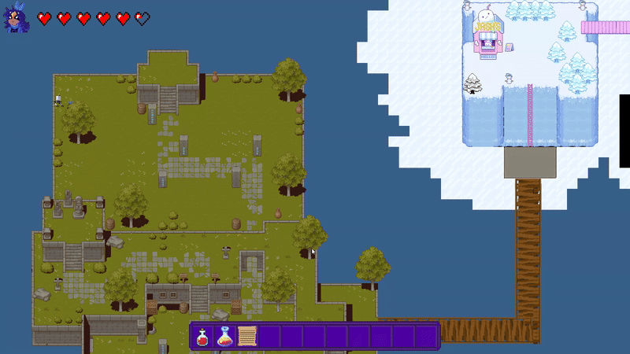

# StarHunter
## Press on the image to check a small demo of the game!

## Features
StarHunter isn't just another game—it’s crafted at a low level using C and the SDL library, giving it precise control over performance, rendering, and input handling. Unlike high-level engines, everything from graphics, physics, and optimizations had to be carefully coded to bring this world to life!

### Inventory

The inventory system can hold up to 24 items in total. Of these, up to 11 items can be placed in the hotbar, while the player can equip one main weapon. Items can be freely moved within the inventory using a drag-and-drop interface, and some items can be activated directly from the hotbar for quick use.

### Dialogue Box

A dynamic text box displays dialogue to the player, accompanied by the face of the character speaking, adding a visual touch to the conversation.

### Map

The game world is built using a 2D map created with Tiled, offering flexibility and depth. The map is exported in a .json file format, which is loaded directly into the game for easy modification and updates.

### Sound

Sound plays a crucial role in the game's immersive experience. The background music from the main menu and the game are both from Zelda games.

### Main menu

The main menu, created from scratch in SDL, is the heart of the player’s settings and interactions. It features custom code for sound settings, resolution adjustments, and a smooth user interface with animations to make it more alive

